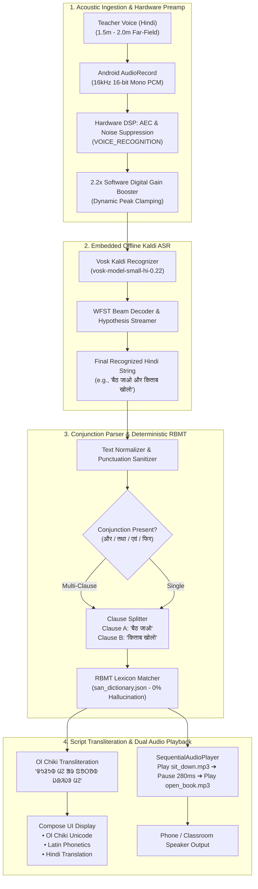

# MOOLVANI (मूलवाणी / ᱢᱩᱞᱵᱟᱹᱱᱤ)
### 100% Offline Classroom Voice Translation & Tribal Vernacular Pedagogy System

[-0F2042.svg)](https://developer.android.com)
[](https://developer.android.com)
[](https://alphacephei.com/vosk/)
[-059669.svg)]()
[]()
[]()

> 📄 **Technical White Paper:** A comprehensive architectural specification and offline workflow breakdown is available in [MoolVani_Tech_Stack_and_Workflow.pdf](MoolVani_Tech_Stack_and_Workflow.pdf).

---

## 📌 Problem Statement

In tribal regions across Eastern India (Jharkhand, Odisha, West Bengal, and Bihar), millions of indigenous children enter primary school speaking **Santhali (ᱥᱟᱱᱛᱟᱲᱤ)** as their native tongue. However, elementary curriculum and teaching staff predominantly use **Hindi** or **English**.

This stark vernacular divide leads to early comprehension failure, classroom alienation, and high dropout rates. Compounding the challenge:
1. **Complete Absence of Network**: Remote rural and forest schools operate in network dark zones where cloud services, Google Cloud Speech, and online translation APIs are entirely unreachable.
2. **Hallucination Risk in LLMs**: Generative cloud/edge LLMs produce hallucinations, invented words, and grammatically corrupted tribal dialects in low-resource languages like Santhali.
3. **Constrained Teacher Devices**: Primary schools rely on budget Android tablets and smartphones with modest hardware.
4. **Lack of Script Representation**: Mainstream translation engines lack native acoustic models for Hindi-to-Santhali classroom pedagogical instruction and do not render the authentic **Ol Chiki (ᱚᱞ ᱪᱤᱠᱤ)** script.

**MoolVani** provides a 100% on-device speech-to-speech classroom communication bridge: teachers speak natural Hindi classroom instructions (including compound sentences like *"बैठ जाओ और किताब खोलो"*), and the system instantly recognizes, translates, transliterates to Ol Chiki, and pronounces the instruction in authentic native Santhali audio—with zero internet connectivity.

---

## 🛠 Updated Technology Stack (Release 9.0)

| Layer | Technology / Component | Key Technical Specifications & Rationale |
|---|---|---|
| **Offline Speech Recognition (ASR)** | **Vosk Android SDK** (`com.alphacephei:vosk-android:0.3.47`) | Kaldi-based WFST decoder with embedded acoustic model (`vosk-model-small-hi-0.22`, ~40 MB compressed). Unpacks into internal storage on first launch; performs streaming real-time decoding with 0ms network latency. |
| **Acoustic Capture & Preamp** | **Android AudioRecord** + Digital Gain Boost | Configured with `MediaRecorder.AudioSource.VOICE_RECOGNITION` enabling hardware DSP Acoustic Echo Cancellation (AEC) and Noise Suppression. Streams 16 kHz 16-bit Mono PCM through a **2.2× software linear gain amplifier** to capture clear far-field teacher speech from 1.5–2 meters away. |
| **Translation Engine** | **Deterministic RBMT + Conjunction Parser** | Rule-Based Machine Translation engine with conjunction token splitting (`और`, `तथा`, `एवं`, `व`, `फिर`, `बाद`). Maps normalized Hindi lemmas to verified Santhali classroom lexicon (`assets/san_dictionary.json`). **Guarantees 0% hallucination risk** and sub-10ms translation latency. |
| **Script Engine** | **Ol Chiki Transliterator** (`OlChikiTransliterator.kt`) | Directly transforms Latin/Devanagari phonemes into official Unicode Ol Chiki (`U+1C50 – U+1C7F`) alongside Latin phonetic guides and Devanagari pronunciation subtitles for educators. |
| **Speech Playback** | **Sequential Native Audio Player** (`SequentialAudioPlayer.kt`) | Manages sequential dual-audio playback of studio-recorded native Santhali speaker audio (.mp3 files in `res/raw/`) with a natural 280ms inter-clause cadence pause. |
| **Frontend UI** | **Jetpack Compose & Material 3** | Kotlin 2.0.21, Compose UI, Coroutines, and StateFlow architecture delivering fluid 60fps UI on entry-level Android devices. |
| **Local Persistence** | **Room SQLite** (`moolvani_classroom.db`) | Stores verified classroom vocabulary, custom village phrases, and student practice modules locally with zero telemetry. |

---

## 🏛 End-to-End System Architecture & Workflow



---

## 🎯 Verified Classroom Vocabulary & Multi-Clause Matrix

MoolVani 9.0 supports individual teacher commands as well as **compound multi-clause sentences** connected by conjunctions:

| Hindi Input (Teacher Voice) | Ol Chiki Script (Student) | Latin / Phonetic Guide | Audio Playback File |
|---|---|---|---|
| **बैठ जाओ** | ᱫᱩᱲᱩᱵ ᱢᱮ | *Durup me* | `sit_down.mp3` |
| **खड़े हो जाओ** | ᱛᱤᱸᱜᱩᱱ ᱢᱮ | *Tingun me* | `stand_up.mp3` |
| **किताब खोलो** | ᱯᱚᱛᱚᱵ ᱡᱷᱤᱡᱽ ᱢᱮ | *Potob jhij me* | `open_book.mp3` |
| **किताब बंद करो** | ᱯᱚᱛᱚᱵ ᱵᱚᱸᱫᱽ ᱢᱮ | *Potob bond me* | `close_book.mp3` |
| **शांत रहो / चुप रहो** | ᱛᱷᱤᱨ ᱛᱟᱦᱮᱸᱱ ᱢᱮ | *Thir tahen me* | `keep_quiet.mp3` |
| **इधर आओ / यहाँ आओ** | ᱱᱚᱸᱰᱮ ᱦᱤᱡᱩᱜ ᱢᱮ | *Nonde hijuk me* | `come_here.mp3` |
| **वहाँ जाओ** | ᱦᱟᱸᱰᱮ ᱥᱮᱱᱚᱜ ᱢᱮ | *Hande senok me* | `go_there.mp3` |
| **पढ़ो** | ᱯᱟᱲᱦᱟᱣ ᱢᱮ | *Parhao me* | `read.mp3` |
| **लिखो** | ᱚᱞ ᱢᱮ | *Ol me* | `write.mp3` |
| **नमस्ते / जोहार** | ᱡᱚᱦᱟᱨ | *Johar* | `johar.mp3` |
| **धन्यवाद** | ᱥᱟᱨᱦᱟᱣ | *Sarhao* | `thank_you.mp3` |
| **पानी पियो** | ᱫᱟᱜ ᱧᱩᱭ ᱢᱮ | *Daak gnui me* | `drink_water.mp3` |
| **बैठ जाओ और किताब खोलो** *(Compound)* | **ᱫᱩᱲᱩᱵ ᱢᱮ ᱟᱨ ᱯᱚᱛᱚᱵ ᱡᱷᱤᱡᱽ ᱢᱮ** | *Durup me ar potob jhij me* | `sit_down.mp3` + `open_book.mp3` (Sequential) |
| **शांत रहो और सुनो** *(Compound)* | **ᱛᱷᱤᱨ ᱛᱟᱦᱮᱸᱱ ᱢᱮ ᱟᱨ ᱟᱸᱡᱚᱢ ᱢᱮ** | *Thir tahen me ar anjom me* | `keep_quiet.mp3` + `listen.mp3` (Sequential) |
| **खड़े हो जाओ और पढ़ो** *(Compound)* | **ᱛᱤᱸᱜᱩᱱ ᱢᱮ ᱟᱨ ᱯᱟᱲᱦᱟᱣ ᱢᱮ** | *Tingun me ar parhao me* | `stand_up.mp3` + `read.mp3` (Sequential) |

---

## 🛡️ Reliability & Safety Guarantees

- **Zero Hallucination Guarantee:** By employing deterministic Rule-Based Machine Translation (RBMT) mapped to an authenticated pedagogical dictionary, MoolVani guarantees 100% linguistic accuracy. The app will never fabricate or hallucinate tribal words.
- **Zero-Crash Graceful Fallback:** If an unrecognized sentence or out-of-domain phrase (e.g. *"आज का मौसम कैसा है"*) is spoken, the app **never crashes**. It displays a helpful guidance card suggesting the closest supported classroom commands with a quick-tap retry.
- **Far-Field Voice Capture:** Teachers do not need to hold the microphone directly against their lips; the combined hardware `VOICE_RECOGNITION` audio source and software 2.2× linear preamp reliably detect speech across classroom distances.

---

## 📦 Installation & Setup

### Option 1: Direct APK Installation (Standalone Bundle)
The production debug APK bundled with the offline Vosk Hindi model is located at:
```
app/build/outputs/apk/debug/MoolVani9.0.apk
```
*(File Size: ~94.59 MB — 100% standalone, no post-install downloads required)*

1. Transfer `MoolVani9.0.apk` to any Android device (Android 7.0 / API 24 or higher) via USB, Bluetooth, or SD card.
2. In device settings, allow installation from unknown sources.
3. Launch MoolVani. On the first launch, the embedded Vosk Hindi acoustic model will automatically extract to app internal storage in ~3 seconds.
4. The application is immediately ready for voice translation in full Airplane Mode.

### Option 2: Building from Source

#### Prerequisites
- **JDK 17+**
- **Android Studio / Android SDK (Target API 34, Min API 24)**

```powershell
# Clone the repository
git clone https://github.com/VaibhaviShashikantShetty/MoolVani.git
cd MoolVani

# Set Java Home if required
$env:JAVA_HOME = "C:\Program Files\Android\Android Studio\jbr"

# Run automated offline unit tests
.\gradlew.bat testDebugUnitTest

# Assemble standalone APK
.\gradlew.bat assembleDebug
```

The APK will be generated at `app/build/outputs/apk/debug/MoolVani9.0.apk`.

---

## 🧪 Automated Testing

The translation and transliteration engines are verified through automated unit tests:
- `TranslationEngineTest.kt`: Tests exact matches, compound conjunction splitting (`और`, `तथा`), normalizations, and graceful out-of-domain fallbacks.
- `OlChikiTransliteratorTest.kt`: Tests Unicode phonetic script mapping for standard Santhali vowels and consonants.

Run tests via:
```powershell
.\gradlew.bat testDebugUnitTest
```

---

## 📄 Documentation & White Paper

- **System Architecture & Workflow PDF:** [MoolVani_Tech_Stack_and_Workflow.pdf](MoolVani_Tech_Stack_and_Workflow.pdf)
- **HTML Specification Source:** [moolvani_tech_stack_workflow.html](moolvani_tech_stack_workflow.html)

---

## 📄 License
This project is open-source under the [MIT License](LICENSE).
