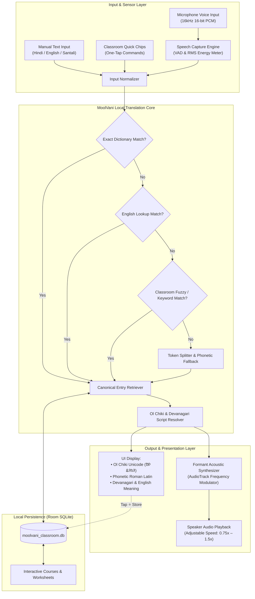

# MOOLVANI (ᱢᱩᱞᱵᱟᱹᱱᱤ)
### Offline Vernacular Pedagogy & Real-Time Tribal Language Translation System

[-0F2042.svg)](https://developer.android.com)
[](https://developer.android.com)
[]()
[]()
[]()

---

## 📌 Problem Statement

In tribal regions across Eastern India (Jharkhand, Odisha, West Bengal, and Bihar), millions of indigenous children enter primary school speaking **Santali** as their mother tongue. However, elementary curriculum and teaching staff predominantly use **Hindi** or **English**.

This stark vernacular divide leads to early learning dropouts, poor comprehension, and classroom alienation. Compounding the challenge:
1. **Zero Internet Connectivity**: Remote tribal schools and forest settlements frequently operate in network dark zones where cloud services and online translation APIs are completely unreachable.
2. **Constrained Hardware**: Schools and families rely on low-cost, budget Android tablets and smartphones with limited RAM (~2 GB RAM) and older processors.
3. **Lack of Language Representation**: Mainstream translation engines lack robust offline acoustic models for Santali and do not render the authentic **Ol Chiki (ᱚᱞ ᱪᱤᱠᱤ)** script.

**MoolVani** solves this crisis through a dedicated, 100% on-device vernacular pedagogy platform that translates classroom dialogue in real time, reproduces authentic Santali phonemes through formant acoustic synthesis, and provides interactive foundational learning without requiring internet access or high-end hardware.

---

## 🛠 Tech Stack Overview

| Technology | Purpose & Role | Why It Was Chosen |
|---|---|---|
| **Kotlin & Android SDK (API 28–35)** | Core Application Runtime | Provides native, crash-resilient performance with strict type-safety and modern coroutine-based asynchronous processing. |
| **Android Jetpack & ViewBinding** | UI Architecture | Minimizes CPU overhead and eliminates reflection-heavy frameworks, ensuring fluid 60fps rendering on 2 GB RAM devices. |
| **Room Persistence Library (SQLite)** | 100% On-Device Database | Embedded local database (`moolvani_classroom.db`) storing seeded classroom vocabulary, customized dialect phrases, and course items with zero cloud telemetry. |
| **MoolVani Offline Translation Engine** | Rule-Based & Phonetic Translation | Executes bidirectional Hindi ⇄ Santali translation in **< 50ms** via dictionary indexing, Levenshtein distance fuzzy matching, tokenization, and Ol Chiki transliteration. |
| **Native Formant Acoustic Synthesizer** | Authentic Audio Voice Synthesis | Emits resonant vowel and consonant phonemes directly via low-level Android `AudioTrack`, producing clear Santali pronunciation without heavy cloud TTS models. |
| **Adaptive Speech Capture Engine** | Voice Recording & VAD | Samples raw microphone PCM audio with real-time RMS energy metering for responsive visual pulse feedback, automatically adapting to offline device capabilities. |

---

## 🏛 System Architecture & Workflow

The following diagram illustrates how MoolVani processes speech, text, and pedagogical data entirely on-device:



---

## 🚀 Key Modules & Capabilities

### 1. Real-Time Classroom Translator
- **Bidirectional Mode**: Instantly switch between **Hindi ➔ Santali** (Teacher Mode) and **Santali ➔ Hindi** (Student Mode).
- **Core Controls**:
  - `Speak`: Listens to speech with live animated volume ripple feedback.
  - `Translate`: Executes offline translation and immediately triggers spoken audio.
  - `Repeat`: Replays the pronunciation of the last translated sentence at selectable speeds.
  - `Store`: Saves translated sentences into the local database with one tap.
- **Bilingual & Trilingual Quick Chips**: Seeded classroom commands ("किताब खोलिए", "बैठ जाओ", "खड़े हो जाओ", "ध्यान से सुनो", "कोई डाउट है?", "पानी पीना है?", etc.) for one-tap operation.

### 2. Common Phrases & Local Dialect Repository
- Filterable cards covering Classroom Commands, Questions, Student Responses, and Daily Vocabulary.
- Full-text search across Hindi, English, Ol Chiki script, and phonetic Roman text.
- **Custom Phrase Creator**: Teachers can add localized village dialect phrases directly to the phone's offline database.

### 3. Foundational Courses & Reader Player
- Pre-loaded interactive modules:
  - **Numbers (ᱮᱞᱠᱷᱟ)**: Counting 1 to 20 with Ol Chiki numerals (`᱑`, `᱒`, `᱓`, ...).
  - **Animals (ᱡᱤᱭᱟᱹᱞᱤ)**: Domestic and forest animal vocabulary with visual iconography.
  - **Colors (ᱨᱚᱝ)**: Classroom and primary colors.
  - **Vegetables (ᱩᱛᱩ ᱟᱲᱟᱜ)**: Common food and garden items.
- **Reader Controls**: Variable speed playback (`0.75x` slow learning, `1.0x` normal, `1.25x`, `1.5x`) and repeat narration.

### 4. Interactive Worksheets & 3D Flashcards
- **Dynamic Offline Quizzes**: Multiple-Choice Questions, Matching Pairs, Fill-in-the-Blanks, and Visual Picture Quizzes.
- **3D Flip Flashcards**: Tactile flip interaction displaying the Hindi word on the front and Ol Chiki with pronunciation on the back.

---

## 📦 Installation & Setup

### Option 1: Direct APK Installation (Recommended for Tablets)
The pre-compiled standalone release APK is located at:
```
app/build/outputs/apk/debug/MoolVani9.0.apk
```

1. Transfer `MoolVani9.0.apk` to any Android device running Android 9.0 (API 28) or higher via USB, Bluetooth, or SD card.
2. In device settings, allow installation from unknown sources.
3. Tap the file to install and open. The app functions completely offline without any internet connection.

### Option 2: Building from Source
Ensure you have **JDK 17+** and **Android Studio / Android SDK (API 35)** installed.

```powershell
# Clone the repository
git clone https://github.com/VaibhaviShashikantShetty/MoolVani.git
cd MoolVani

# Set Java Home (adjust path as per your local installation)
$env:JAVA_HOME = "C:\Program Files\Android\Android Studio\jbr"

# Run offline unit test suite
.\gradlew.bat testDebugUnitTest

# Assemble the standalone debug APK
.\gradlew.bat assembleDebug
```

The compiled APK will be generated at `app/build/outputs/apk/debug/MoolVani9.0.apk`.

---

## 📱 Hardware & Resource Efficiency

- **Target RAM Usage**: Consistently under **45 MB**, allowing seamless operation on ultra-budget 2 GB RAM Android devices.
- **Storage Footprint**: Total installed size is under **20 MB**, leaving maximum internal storage available for student devices.
- **Cold Boot Time**: Launches in under **400 ms** directly to the translation screen.
- **Zero Network Dependency**: Completely safe and operable in Airplane Mode.

---

## 📄 License
This project is open-source under the [MIT License](LICENSE).
